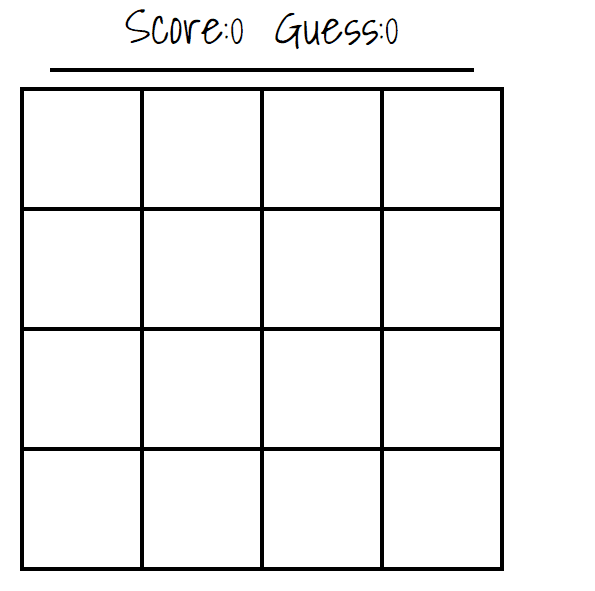

# Find Numbers Puzzle Game

Find Numbers is a puzzle game. The player tries to find numbers that match fewer guesses.

## Development server

Run `ng serve` for a dev server. Navigate to `http://localhost:4200/`. The app will automatically reload if you change any of the source files.

## Build

Run `ng build` to build the project. The build artifacts will be stored in the `dist/` directory. Use the `--prod` flag for a production build.

## To Do List For Developer
- Generate puzzle at server side
- Create an interesting score system
- Add login and ranking system
- Create different game modes as country flags, pokemons, vegatables and fruits instead of boring numbers.

## Game Play

